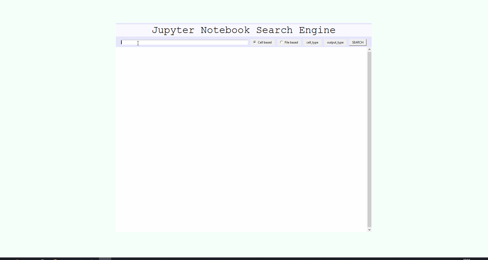

<div id="top"></div>

# Jupyter Notebook cell-type aware search engine (JuNocta)
This project contains a search engine, called JuNocta, that is designed to search within a collection of Jupyter Notebooks. JuNocta is able to distinguish between the different properties of a jupyter notebook cell. JuNocta can use web scraping to create a dataset, use Python pandas to index the dataset and use Elasticsearch to store the dataset locally. JuNocta offers 6 possibilities to make a search more specific. The SERP of JuNocta will provide links to GitHub and/or localhost for each result.

When the requirements are met, the user only has to run a single command in the cmd, to start JuNocta:
```
python main.py
```

## Table of contents
<!-- TABLE OF CONTENTS -->
<ol>
  <li>
    <a href="#about-the-project">About The Project</a>
    <ul>
      <li><a href="#built-with">Built With</a></li>
    </ul>
  </li>
  <li>
    <a href="#getting-started">Getting Started</a>
    <ul>
      <li><a href="#prerequisites">Prerequisites</a></li>
      <li>
      <a href="#installation">Installation</a>
        <ul>
        <li><a href="#before-running-the-main-file">Before running the main.py file</a></li>
        <li><a href="#running-the-main-file">Running the main.py file</a></li>
        </ul>
      </li>
    </ul>
  </li>
  <li>
    <a href="#usage">Usage</a>
    <ul>
      <li><a href="#interactive-start-menu">Interactive start menu cmd</a></li>
      <li><a href="#the-search-engine-itself">The search engine application</a></li>
    </ul>
  </li>
  <li><a href="#license">License</a></li>
  <li><a href="#contact">Contact</a></li>
</ol>

<!-- ABOUT THE PROJECT -->
## About The Project
This search engine, called JuNocta, is designed to search within with (large) datasets of Jupyter Notebooks and is build with Python. Jupyter Notebook is a web-based interactive platform, that provides the option to combine code snippets, computational output, explanatory text, visualations and multimedia. A notebook is divided into cells that are displayed below each other, where each cell can run separately. There exist 4 types of cells: `code`, `markdown`, `heading` and `raw`. Notebooks are saved in the JSON structure. This structure represents structured data in the form of attribute-value pairs (key-value pairs) and arrays. The two images below show the same notebook in its web-based platform and in its json structure.

This is how a notebook is displayed in its JSON structure:

<br/><i>Image 1</i>

This is how the same notebook is displayed on the web-based platform:

<br/><i>Image 2</i>

But how do you search for a specific notebook file or cell within a collection. If a collection of notebooks is stored offline, for example your own laptop, you could use the default file explorer on your operating system. In the file explorer it is possible to search for a filename. In windows 10 it is possible advanced options to search within the content of a file, however this is not 'toepasbaar' op Jupyter Notebook files. If a collection of notebooks is stored on online, for example GitHub, you could use the advanced search provided by GitHub. This does provide the option to search for a filename or within the content, but that is a far as it gets. Most of the advanced filters are related to GitHub characteristics, like amount of stars, repository name, file size or date. 

The solution to these limited search options, is to create our own search engine. JuNocta has a good understanding of the JSON sturcture when indexing the notebooks. It knows which key-value pairs can be of great value for the search engine and which pairs are abundant. It does not index the notebooks as a whole as text, but is aware of the different cell types. If we look at image 2, this means that not the notebook as a whole (line 1-53) gets indexed as text, but only certain key-value pairs are stored.  The following capabilities/functionalities of JuNocta are developed:
1. Filter on cell type (choosing between `markdown`, `code`, `raw` or `heading`)
2. Filter on code output type (choosing between `display_data`, `execute_result`, `stream`, etc.)
3. Split a query (using Boolean operators)
4. Match exact phrases (using double quotes)
5. Specifying fields (stating the field followed by a colon)
6. Search for a single cell or  whole file

Three datasets that differ in size and tidiness are used to test JuNocta:
1. Jake Vanderplas notebooks
     - These notebooks are regarding the two books written by Jake Vanderplas about Python. Jake Vanderplas has published those two entire books on GitHub in the form of Jupyter notebooks. 
     - 86 notebooks / 4.000 cells 
     - The notebooks must be downloaded **manually**, by cloning both [Python DataScience Handbook](https://github.com/jakevdp/PythonDataScienceHandbook) and [Python Whirlwind Tour](https://github.com/jakevdp/WhirlwindTourOfPython)

2. Gallery interesting notebooks (wiki page of Jupyter/Jupyter reposorityr)
     - [This GitHub wiki page](https://github.com/jupyter/jupyter/wiki) is a curated collection of links to Jupyter notebooks that are notable published on by Jupyter itself.
     - 3.000 notebooks / 100.000 cells
     - The notebooks will be downloaded **automatically**. The code will create a list containing links to GitHub repositories mentioned the wiki page, using webscraping after which they are cloned to your own laptop.
3. EECN notebooks
     - The Exploration and Explanation in Computational Notebooks (EECN) is a paper that has webscraped 1.25 million notebooks on GitHub and analyzed those notebooks. The collections of notebooks are split into six 6 zip files, I used "Notebooks files - part 1" for this search engine.
     - 200.000 notebooks / 5.000.000 cells
     - The notebooks must be downloaded **manually**, on [this page](https://library.ucsd.edu/dc/object/bb2733859v)
   


### Built With

* `bs4` / `BeautifoulSoup` for webscraping for github repositories
* `git` for cloning those repositories
* `pandas` for indexing those repositories by creating DataFrames
* `elasticsearch` for inserting those DataFrames into Elasticsearch
* `tktiner` for creating a SERP
* `tk_html_widgets` for creating clickable links in the SERP


<p align="right">(<a href="#top">back to top</a>)</p>

## Getting started


### prerequisites
* [Anaconda](https://www.anaconda.com/products/individual)
  * python+jupyter notebook installer
  * don't forget to add `python` to the path variables
* [Java](https://www.java.com/en/download/)
* Elastic Search [version 7.16.1 msi installer](https://www.elastic.co/downloads/past-releases/elasticsearch-7-16-1)
  * You can also download the newer version 8.*, however there is not a msi installer available for this function. The msi installer tend to be more easy to setup.
  * There are two options during the installation of elasticsearch, regarding starting elasticsearch
       1. always have elasticsearch running in the background
       2. only run elasticsearch after opening it as an admin (**I advise this option**)
* [git bash](https://git-scm.com/downloads):
     * don't forget to add `git` to the path variables, [extra information](https://git-scm.com/book/en/v2/Getting-Started-First-Time-Git-Setup) regarding installation
* manually install the "git" package in the Anaconda Navigator:
  1. In the Anaconda Navigator select the "Enviroments" tab in the left panel
  2. In the dropdown menu in the top panel change "Installed" to "All"
  3. Search for "git" in the "search packages" entry box
  4. Check the box for "git" and press "apply" in the bottom panel to install this package

### installation
#### Before running the `main` file
Before you can run the ```main.py``` file, two actions need to be performed:
1. Have the elasticsearch enviroment run in the background
2. Have the jupyter notebook enviroment run in the background
   * IT IS IMPORTANT to open jupyter notebook in the directory of this folder that is cloned by you. 
   
   This is necassary to create links to files on the localhost/8888. These links consists of two parts: it starts with the standard localhost url (`http://localhost:8888/notebooks/`) and followed by the path to the notebook file (`path/notebook_file`). Here it gets more complicated, as is not always just the path to where the notebook file is stored on your laptop. The path starts with the directory in which the juypter notebook enviroment is opened. This could be vary between different users. Some users might open it by default on the C disk (for example `C:\User\..\search_engine_junocta\demo_dataset\notebook_file`), others on an G disk (for example `G:\..\search_engine_junocta\demo_dataset\notebook_file`), another might it in the same directory in which this folders is cloned (for example `demo_dataset\notebook_file`). Unfortunatelly it is not possible to determine on which directory of a Jupyter notebook is opened. Therefore, to avoid issues it is mandatory for all users to open it in the same way.
   
   An example of a link, that is created following the rules, is `http://localhost:8888/notebooks/dataset_demo/(agconti)kaggle-titanic/Titanic.ipynb`. 

There are two ways to navigate to the right directory:
1. Navigate in the file explorer to where this directory is cloned, when in the right directory type "cmd" in the address bar and press enter. This causes a command prompt to be opened in the right directory.
2. Navigate in the command promt manually to where this directory is cloned, by using the `cd` command. For example, if you want to go to the folder `search_engine`:
```
cd desktop/search_engine_junocta
```
After either of the 2 options is used to open the command promt in the right directory, open the jupyter notebook enviroment by using the following command:
```
jupyter notebook
```


#### Running the `main` file
Now open a second command promt and navigate again to the right directory (by using either of the two options just described) and run the `main.py` file by using the following command:
```
python main.py
```

An important variable is `choose_dataset` on line 28 in the file `widget_new.py` and on line 30 in the file `main.py`. On default this variable is set to `demo`, the user must change and save the variable in both file manually and run the `python main.py` command again in the command promt in order for JuNocta to work with a different dataset (for example `1`, `2` or `3`).

<p align="right">(<a href="#top">back to top</a>)</p>

## Usage

### Interactive start menu
After the user has run the `main.py` command, the user is met with an interactive shell in which 5 options presented:
1. Press (1) to run all the following options consecutively: (2), (3), (4)
2. Press (2) to clone the repositories,
3. Press (3) to setup elasticsearch,
4. Press (4) to open the search engine,
5. Press (q) to quit

These options are presented separately for the user on purpose. For the first time use, the user normally would use option 1 to automatically clone the repositories, setup elasticsearch and open the search engine application. When the the search engine is closed, the cloned repositories will stay on your laptop and the indexed dataset into elasticsearch (on localhost:9200) will still be present. Meaning there will be no need to clone the repositories and setup elasticsearch again for a second time, which could be time consuming depending on the size. Therefore option 4 exists.


### The search engine itself

When `1` or `4` is pressed, a new window will pop up. This window contains the tkinter application in which the search engine is designed. The search engine provides the user with a entry box to type the query. After which the user can either click on the search button or press the `enter` button on his keyboard. As explained earlier, the search engine provides six functionalities when searching
1. Using the 'cell_type' dropdown menu to choose a cell_type (`markdown`, `code`, `raw` or `heading`)
2. Using the 'output_type' dropdown menu to choose a code output_type (`stream`, `execute_result`,`display_data`, `pyout`, `error`, `pyerr` or `no output`)
3. Using Boolean operators and parentheses to split queries
4. Using double quotes to match exact phrases
5. Using a field followed by a colon to specifiying a field to search within
6. Using the radiobottoms to choose whether to search for a single cell or whole file

When searching cell-based and when two cell_type variables in the dropdown menu are chosen, the results should either be on of those two cell types. When search file-based and when two cell_type variables are chosen, each result should contain at least both those two cell types in its file. On default, none of the items in both of the dropdown menu are checked. Meaning the cell_type and output_type will make no differentiation in searching.

These six functionalities are demonstrated in the image below:


After the user has clicked the search button or pressed `enter`, the results will be displayed in a scrollable window bellow the entry box. The results are separeted with a grey filled row and each result has multiple clickable links:
1. A link to the GitHub user
2. A link to the GitHub repository
3. A link to the file on GitHub
4. A link to the file on the localhost/8888 to the highlighted text (highlighted text only works on Chrome)



When the user closes the tkinter application by clicking the topright closebutton, the user is presented with the interactive start menu in the command prompt again. In this menu the user is met with 5 options previously described.

To find more information about this project, you can read the thesis [here](thesis.pdf)
<p align="right">(<a href="#top">back to top</a>)</p>

## License

Distributed under the GNU GPLv3 License. See LICENSE.md for more information.

<p align="right">(<a href="#top">back to top</a>)</p>

## Contact

Kennet - tisuke_tennek@tutanota.com

Project Link: https://github.com/kennitos/search_engine_junocta


<p align="right">(<a href="#top">back to top</a>)</p>
